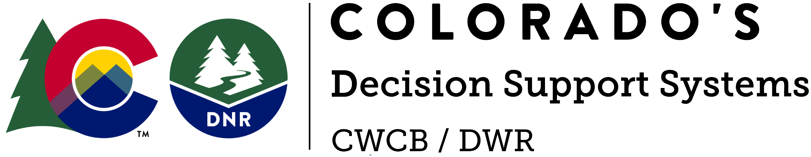
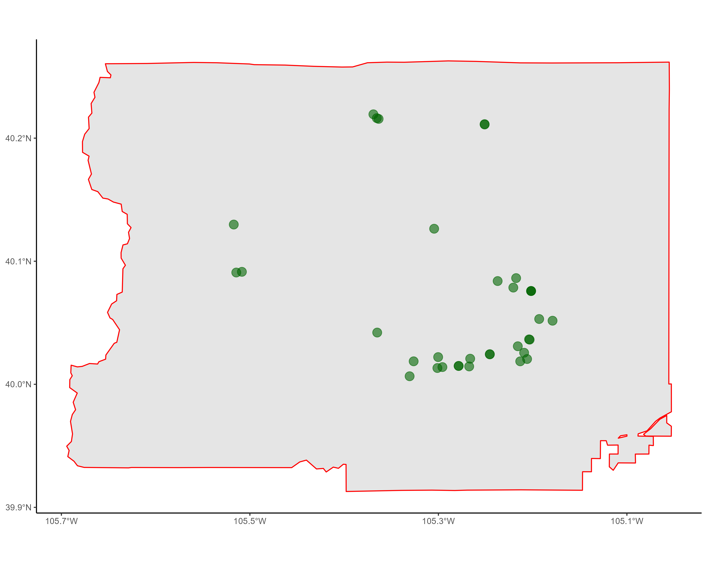
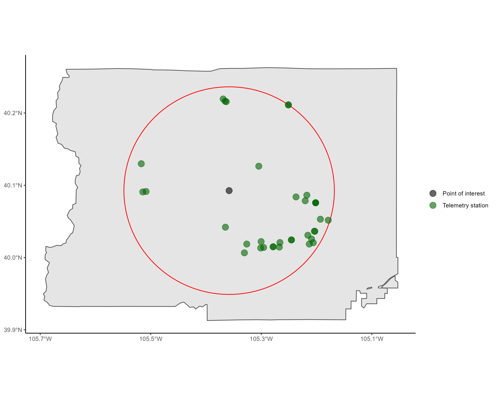
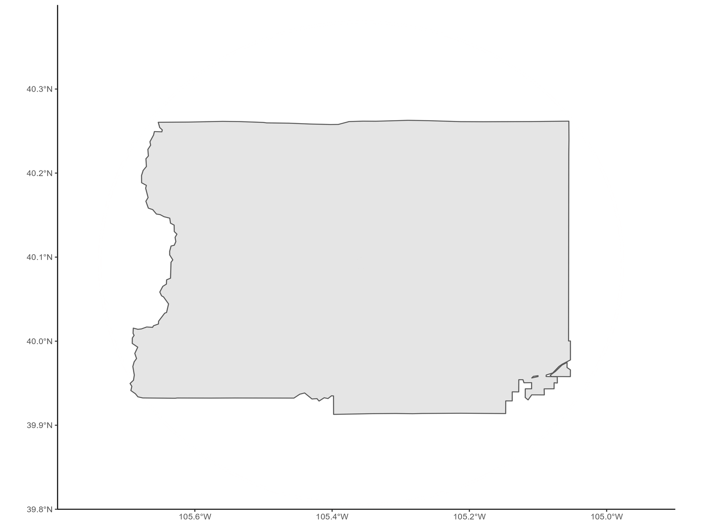
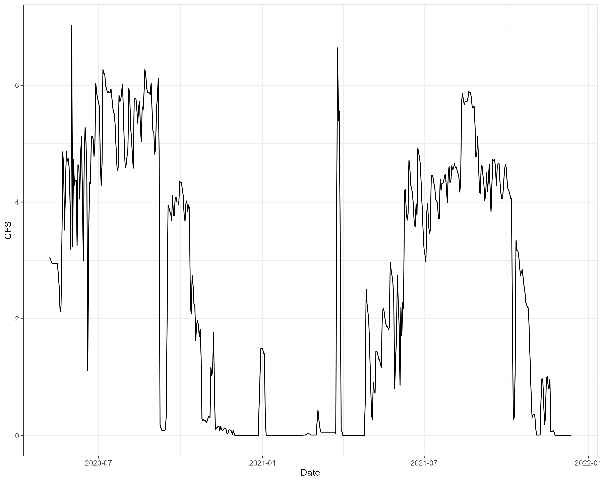
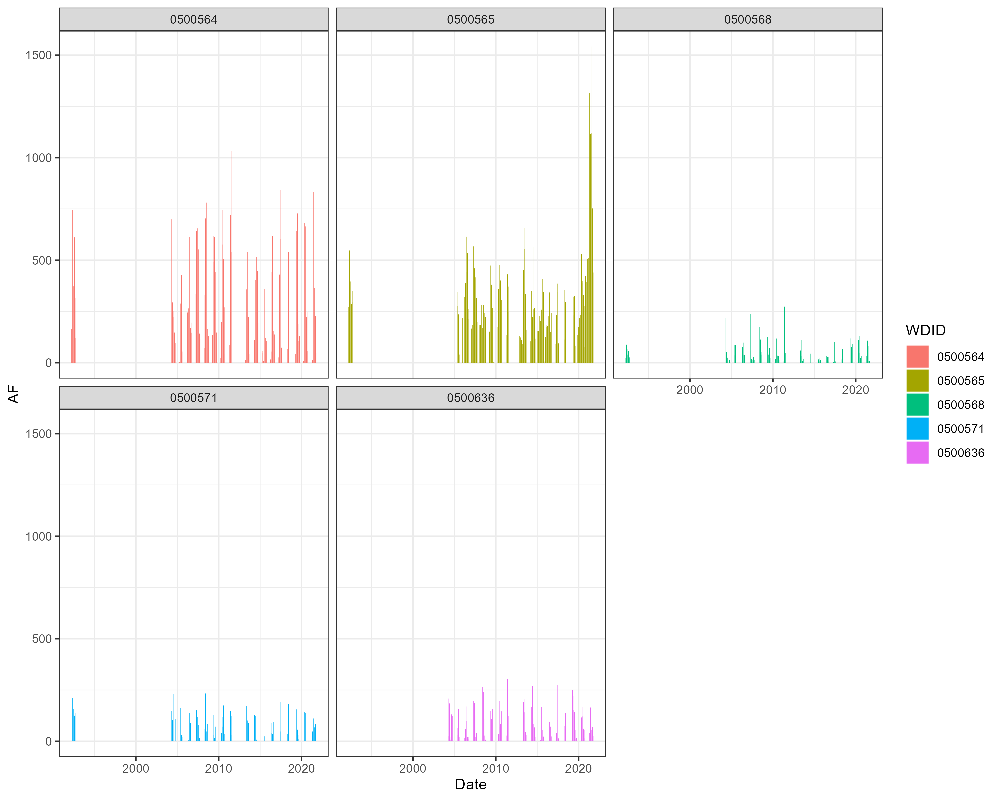
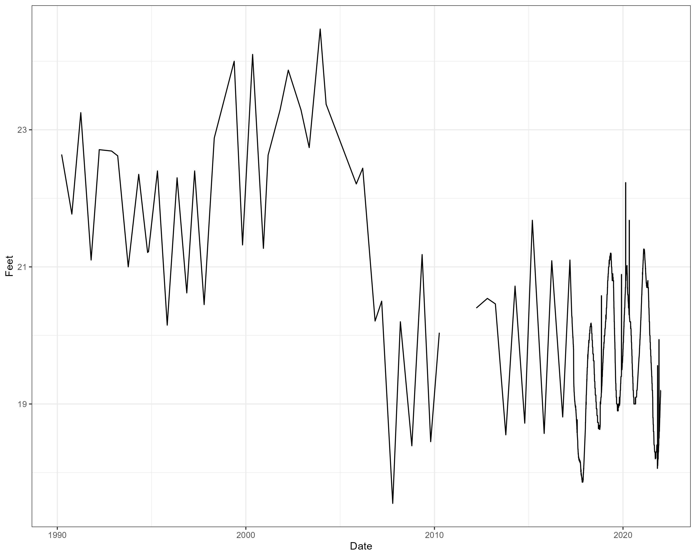

# **cdsspy** 

<!-- badges: start -->

[](#)
[](https://choosealicense.com/licenses/mit/)
<!-- badges: end -->

<div align="left">

<p align="left">
<a href="https://dwr.state.co.us/Tools"><strong>« CDSS »</strong></a>
<br /> <a href="https://dwr.state.co.us/Rest/GET/Help">CDSS REST Web
Services</a>
</p>

</div>

<hr>

The goal of [**`cdsspy`**](https://pypi.org/project/cdsspy/) is to provide functions that help Python users to navigate, explore, and make requests to the CDSS REST API web service. 

The Colorado’s Decision Support Systems (CDSS) is a water management system created and developed by the Colorado Water Conservation Board (CWCB) and the Colorado Division of Water Resources (DWR).

Thank you to those at CWCB and DWR for providing an accessible and well documented REST API!

<br>

> See [**`cdssr`**](https://github.com/anguswg-ucsb/cdssr), for the **R** version of this package

---

- [**cdssr (R)**](https://github.com/anguswg-ucsb/cdssr)

- [**cdssr documentation**](https://anguswg-ucsb.github.io/cdssr/)

- [**cdsspy (Python)**](https://github.com/anguswg-ucsb/cdsspy)

- [**cdsspy documentation**](https://pypi.org/project/cdsspy/)

---

<br> 

## **Installation**
Install the latest version of **`cdsspy`** from [PyPI](https://pypi.org/project/cdsspy/):

``` 
pip install cdsspy
```
<br>

## **Available endpoints**

Below is a table of all of the CDSS API endpoints **`cdsspy`** provides functions for.

|**-** |**Function**                    | **Description**                                                    | **Endpoint**                                 |
|------|--------------------------------| -------------------------------------------------------------------|----------------------------------------------|
|1     | **get_admin_calls()**          | Returns list of active/historic administrative calls               | [administrativecalls/active](https://dwr.state.co.us/rest/get/help#Datasets&#AdministrativeCallsController&https://dnrweblink.state.co.us/dwr/ElectronicFile.aspx?docid=3600964&dbid=0&#gettingstarted&#jsonxml)            |
|2     | **get_structures()**           | Returns list of administrative structures                          | [structures](https://dwr.state.co.us/rest/get/help#Datasets&#StructuresController&#gettingstarted&#jsonxml)                            |
|3     | **get_structures_divrec_ts()**    | Returns list of diversion/release records based on WDID      | [structures/divrec/divrec](https://dwr.state.co.us/rest/get/help#Datasets&#DiversionRecordsController&https://dnrweblink.state.co.us/dwr/ElectronicFile.aspx?docid=3600965&dbid=0&#gettingstarted&#jsonxml)              |
|4     | **get_structures_stage_ts()**    | Returns list of stage/volume records based on WDID      | [structures/divrec/stagevolume](https://dwr.state.co.us/rest/get/help#Datasets&#DiversionRecordsController&https://dnrweblink.state.co.us/dwr/ElectronicFile.aspx?docid=3600965&dbid=0&#gettingstarted&#jsonxml)              |
|5     | **get_climate_stations()**     | Returns Climate Stations                                           | [climatedata/climatestations](https://dwr.state.co.us/rest/get/help#Datasets&#ClimateStationsController&https://www.ncdc.noaa.gov/cdo-web/webservices&https://www.northernwater.org/our-data/weather-data&#gettingstarted&#jsonxml)           |
|6     | **get_climate_ts()**           | Returns Climate Station Time Series (day, month, year)             | [climatedata/climatestationts](https://dwr.state.co.us/rest/get/help#Datasets&#ClimateStationsController&https://www.ncdc.noaa.gov/cdo-web/webservices&https://www.northernwater.org/our-data/weather-data&#gettingstarted&#jsonxml)       |
|7     | **get_climate_frostdates()**           | Returns Climate Station Frost Dates             | [climatedata/climatestationfrostdates](https://dwr.state.co.us/rest/get/help#Datasets&#ClimateStationsController&https://www.ncdc.noaa.gov/cdo-web/webservices&https://www.northernwater.org/our-data/weather-data&#gettingstarted&#jsonxml)       |
|8     | **get_gw_gplogs_wells()**          | Returns Groundwater GeophysicalLogsWell from filters           | [groundwater/geophysicallogs/](https://dwr.state.co.us/rest/get/help#Datasets&#GroundwaterGeophysicalLogsController&#gettingstarted&#jsonxml)                          |
|9     | **get_gw_gplogs_geologpicks()**          | Returns Groundwater Geophysical Log picks by well ID           | [groundwater/geophysicallogs/](https://dwr.state.co.us/rest/get/help#Datasets&#GroundwaterGeophysicalLogsController&#gettingstarted&#jsonxml)                          |
|10     | **get_gw_wl_wells()**          | Returns WaterLevelsWell from filters           | [groundwater/waterlevels/wells](https://dwr.state.co.us/rest/get/help#Datasets&#GroundwaterLevelsController&#gettingstarted&#jsonxml)                          |
|11     | **get_gw_wl_wellmeasures()**          | Returns  Groundwater Measurements | [groundwater/waterlevels/wellmeasurements](https://dwr.state.co.us/rest/get/help#Datasets&#GroundwaterLevelsController&#gettingstarted&#jsonxml)                          |
|12     | **get_reference_tbl()**        | Returns reference tables list                                      | [referencetables/](https://dwr.state.co.us/rest/get/help#Datasets&#ReferenceTablesController&#gettingstarted&#jsonxml)                      |
|13     | **get_sw_stations()**          | Returns Surface Water Station info                                 | [surfacewater/surfacewaterstations](https://dwr.state.co.us/rest/get/help#Datasets&#SurfaceWaterController&#gettingstarted&#jsonxml)     |
|14    | **get_sw_ts()**                | Returns Surface Water Time Series                                  | [surfacewater/surfacewaterts](https://dwr.state.co.us/rest/get/help#Datasets&#SurfaceWaterController&#gettingstarted&#jsonxml)        |
|15    | **get_telemetry_stations()**   | Returns telemetry stations and their most recent parameter reading | [telemetrystations/telemetrystation](https://dwr.state.co.us/rest/get/help#Datasets&#TelemetryStationsController&#gettingstarted&#jsonxml)    |
|16    | **get_telemetry_ts()**         | Returns telemetry time series data (raw, hour, day) | [telemetrystations/telemetrytimeseries](https://dwr.state.co.us/rest/get/help#Datasets&#TelemetryStationsController&#gettingstarted&#jsonxml)|
|17    | **get_water_rights_netamount()**   | Returns current status of a water right based on all of its court decreed actions | [waterrights/netamount](https://dwr.state.co.us/rest/get/help#Datasets&#WaterRightsController&#gettingstarted&#jsonxml)    |
|18    | **get_water_rights_trans()**         | Returns court decreed actions that affect amount and use(s) that can be used by each water right | [waterrights/transaction](https://dwr.state.co.us/rest/get/help#Datasets&#WaterRightsController&#gettingstarted&#jsonxml)|
|19    | **get_call_analysis_wdid()**   | 	Performs a call analysis that returns a time series showing the percentage of each day that the specified WDID and priority was out of priority and the downstream call in priority | [analysisservices/callanalysisbywdid](https://dwr.state.co.us/rest/get/help#Datasets&#AnalysisServicesController&#gettingstarted&#jsonxml)    |
|20    | **get_source_route_framework()**         | Returns the DWR source route framework reference table for the criteria specified | [analysisservices/watersourcerouteframework](https://dwr.state.co.us/rest/get/help#Datasets&#AnalysisServicesController&#gettingstarted&#jsonxml)|

<br>
<br>
<br>

## **Identify query inputs using reference tables**

The **`get_reference_tbl()`** function will return tables that makes it easier to know what information should be supplied to the data retrieval functions in **`cdsspy`**. For more information on the source reference tables click [here](https://dwr.state.co.us/rest/get/help#Datasets&#ReferenceTablesController&#gettingstarted&#jsonxml).

<br>

```python
# available parameters for telemetry stations
telemetry_params = cdsspy.get_reference_tbl(
    table_name = "telemetryparams"
    )
```

|    | Parameter   |
|---:|:------------|
|  0 | AIRTEMP     |
|  1 | BAR_P       |
|  2 | BATTERY     |
|  3 | COND        |
|  4 | D1          |
|  5 | D2          |
|  6 | DISCHRG     |
|  7 | DISCHRG1    |
|  8 | DISCHRG2    |
|  9 | DISCHRG3    |
| 10 | DISCHRG4    |
| 11 | ELEV        |

<br>
<br>
<br>

## **Locate structures**

**`cdsspy`** provides functions for locating structures/stations/wells/sites by providing a spatial extent, water district, division, county, designated basin, or management district to the functions in the table below. Site data can also be retrieved by providing the site specific abbreviations, GNIS IDs, USGS IDs, WDIDs, or Well IDs.
|**-** |**Function**                    | **Description**                                                    | **Endpoint**                                 |
|------|--------------------------------| -------------------------------------------------------------------|----------------------------------------------|
|1     | **get_structures()**           | Returns list of administrative structures                          | [structures](https://dwr.state.co.us/rest/get/help#Datasets&#StructuresController&#gettingstarted&#jsonxml)                            |          |
|2     | **get_climate_stations()**     | Returns Climate Stations                                           | [climatedata/climatestations](https://dwr.state.co.us/rest/get/help#Datasets&#ClimateStationsController&https://www.ncdc.noaa.gov/cdo-web/webservices&https://www.northernwater.org/our-data/weather-data&#gettingstarted&#jsonxml)           |
|3     | **get_gw_gplogs_wells()**          | Returns Groundwater GeophysicalLogsWell from filters           | [groundwater/geophysicallogs/](https://dwr.state.co.us/rest/get/help#Datasets&#GroundwaterGeophysicalLogsController&#gettingstarted&#jsonxml)                          |
|4     | **get_gw_wl_wells()**          | Returns WaterLevelsWell from filters           | [groundwater/waterlevels/wells](https://dwr.state.co.us/rest/get/help#Datasets&#GroundwaterLevelsController&#gettingstarted&#jsonxml)                          |
|5     | **get_sw_stations()**          | Returns Surface Water Station info                                 | [surfacewater/surfacewaterstations](https://dwr.state.co.us/rest/get/help#Datasets&#SurfaceWaterController&#gettingstarted&#jsonxml)     |
|6    | **get_telemetry_stations()**   | Returns telemetry stations and their most recent parameter reading | [telemetrystations/telemetrystation](https://dwr.state.co.us/rest/get/help#Datasets&#TelemetryStationsController&#gettingstarted&#jsonxml)    |                     

<br>

### **Example: Locating telemetry stations by county:**

```python
# identify telemetry stations in Boulder County
stations  = cdsspy.get_telemetry_stations(
    county = "Boulder"
    )
```



<br>
<br>

### **Example: Locating telemetry stations around a point**

```python
# identify telemetry stations within a 15 mile radius of the center point of Boulder County
stations  = cdsspy.get_telemetry_stations(
    aoi    = [-105.358164, 40.092608],
    radius = 15
    )
```



<br>
<br>

### **Example: Locating telemetry stations within a spatial extent**
A masking operation is performed when a location search is done using a **polygon**. This ensures that the function only returns points that are ***within*** the given polygon. 

```python
# identify telemetry stations 15 miles around the centroid of a polygon
stations  = cdsspy.get_telemetry_stations(
    aoi    = geopandas.read_file("example-data/boulder_county.gpkg")
    radius = 15
    )
```

This gif highlights the masking process that happens when the **`aoi`** argument is given a **polygon** 



<br>
<br>
<br>
<br>


## **Retrieve time series data** 

The functions in the table below retrieve time series data from the various time series related CDSS API endpoints.  

|**-** |**Function**                    | **Description**                                                    | **Endpoint**                                 |
|------|--------------------------------| -------------------------------------------------------------------|----------------------------------------------|
|1     | **get_structures_divrec_ts()**    | Returns list of diversion/release records based on WDID      | [structures/divrec/divrec](https://dwr.state.co.us/rest/get/help#Datasets&#DiversionRecordsController&https://dnrweblink.state.co.us/dwr/ElectronicFile.aspx?docid=3600965&dbid=0&#gettingstarted&#jsonxml)              |
|2     | **get_structures_stage_ts()**    | Returns list of stage/volume records based on WDID      | [structures/divrec/stagevolume](https://dwr.state.co.us/rest/get/help#Datasets&#DiversionRecordsController&https://dnrweblink.state.co.us/dwr/ElectronicFile.aspx?docid=3600965&dbid=0&#gettingstarted&#jsonxml)              |
|3     | **get_climate_ts()**           | Returns Climate Station Time Series (day, month, year)             | [climatedata/climatestationts](https://dwr.state.co.us/rest/get/help#Datasets&#ClimateStationsController&https://www.ncdc.noaa.gov/cdo-web/webservices&https://www.northernwater.org/our-data/weather-data&#gettingstarted&#jsonxml)       |
|4     | **get_gw_wl_wellmeasures()**          | Returns  Groundwater Measurements | [groundwater/waterlevels/wellmeasurements](https://dwr.state.co.us/rest/get/help#Datasets&#GroundwaterLevelsController&#gettingstarted&#jsonxml)                          |
|5    | **get_sw_ts()**                | Returns Surface Water Time Series                                  | [surfacewater/surfacewaterts](https://dwr.state.co.us/rest/get/help#Datasets&#SurfaceWaterController&#gettingstarted&#jsonxml)        |
|6    | **get_telemetry_ts()**         | Returns telemetry time series data (raw, hour, day) | [telemetrystations/telemetrytimeseries](https://dwr.state.co.us/rest/get/help#Datasets&#TelemetryStationsController&#gettingstarted&#jsonxml)|

<br>
<br>

#### **Example: Daily discharge at a telemetry station**
We can then take a station abbreviations from the **`get_telemetry_stations()`** call, a parameter from the **`get_reference_tbl()`** call, and use this information as inputs into the **`get_telemetry_ts()`** function. 

<br>

The function below returns a dataframe of daily discharge for the "ANDDITCO" site between 2015-2022.

```python
# Daily discharge at "ANDDITCO" telemetry station
discharge_ts   = cdsspy.get_telemetry_ts(
    abbrev         = "ANDDITCO",     # Site abbreviation from the outputs of get_telemetry_stations()
    parameter      = "DISCHRG",      # Desired parameter, identified by the get_reference_tbl()
    start_date     = "2015-01-01",   # Starting date
    end_date       = "2022-01-01",   # Ending date
    timescale      = "day"           # select daily timescale
    )
```



<br>
<br>

#### **Example: Retrieve Diversion records for multiple structures**
Some of the CDSS API endpoints allow users to request data from multiple structures if you provide a list of IDs. If we want to get diversion data from multiple structure locations, we'll need to get a list of WDIDs. We can get a list WDIDs within a given area by:  


1. Executing a spatial search using **`get_structures()`** 
2. Selecting the WDIDs of interest from the search results
3. Providing the WDIDs as a vector to **`get_structures_divrec_ts()`** 


```python 
# 1. Executing a spatial search
structures = cdsspy.get_structures(
    aoi    = [-105.3578, 40.09244],
    radius = 5
    )

# 2. Selecting the WDID's of interest from search results and putting WDIDs into a list
ditch_wdids = structures[(structures["ciuCode"] == "A") & (structures["structureType"] == "DITCH")]
ditch_wdids = list(ditch_wdids['wdid'])

# 3. Providing the WDID's as a list to get_structures_divrec_ts()
diversion_rec  = cdsspy.get_structures_divrec_ts(
    wdid           = ditch_wdids,
    wc_identifier  = "diversion",
    timescale      = "month"
    )
```
**Note:** Data availability can vary between structures (i.e. Missing data, not all structures have every data type/temporal resolution available, etc.) 



<br>
<br>
<br>
<br>

## **Retrieve groundwater data**
The **`get_gw_()`** set of functions lets users retrieve data from the various groundwater related API endpoints shown in the table below:

| **-** | **Function**                    | **Endpoint**                                                                                                                                     |
|-------|---------------------------------|--------------------------------------------------------------------------------------------------------------------------------------------------|
| 1     | **get_gw_wl_wellmeasures()**    | [api/v2/groundwater/waterlevels/wellmeasurements](https://dwr.state.co.us/Rest/GET/Help/Api/GET-api-v2-groundwater-waterlevels-wellmeasurements) |
| 2     | **get_gw_wl_wells()**           | [api/v2/groundwater/waterlevels/wells](https://dwr.state.co.us/Rest/GET/Help/Api/GET-api-v2-groundwater-waterlevels-wells)                       |
| 3     | **get_gw_gplogs_wells()**       | [api/v2/groundwater/geophysicallogs/wells](https://dwr.state.co.us/Rest/GET/Help/Api/GET-api-v2-groundwater-geophysicallogs-wells)               |
| 4     | **get_gw_gplogs_geologpicks()** | [api/v2/groundwater/geophysicallogs/geoplogpicks](https://dwr.state.co.us/Rest/GET/Help/Api/GET-api-v2-groundwater-geophysicallogs-geoplogpicks) |

<br>

Here we will retrieve groundwater well measurement data for Well ID 1274 between 2021-2022.

```python
# Request wellmeasurements endpoint (api/v2/groundwater/waterlevels/wellmeasurements)
well_measure = cdsspy.get_gw_wl_wellmeasures(
    wellid     = "1274",
    start_date = "1990-01-01",
    end_date   = "2022-01-01"
    )
```


